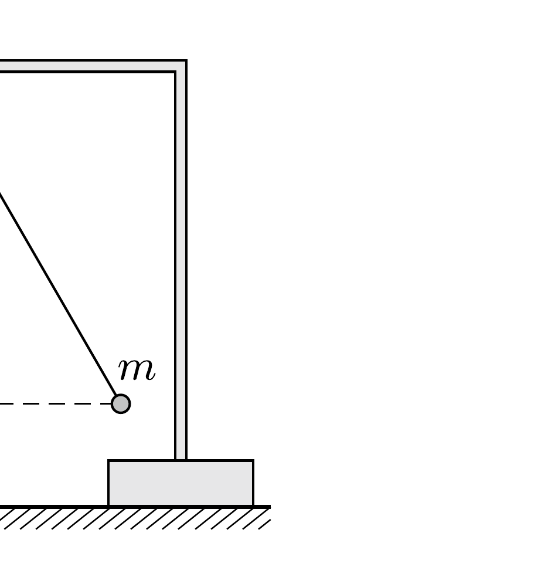

Egy $m$ tömegú, kicsiny golyócskát egy állványról lelógó, könnyú szigetelő szál alsó végéhez rögzítünk, majd a golyót pozitív töltéssel feltöltjük. Egy másik, ugyancsak pozitív töltésú kis testet jó messziről lassan éppen oda viszünk, ahol eredetileg az elsó test volt. Eközben az elsó test $h$ magasságba emelkedik. Mennyi munkát végeztünk a második test mozgatása során?

