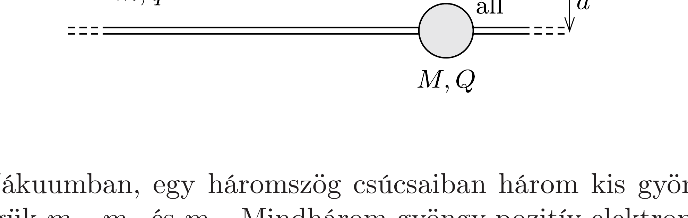

Két hosszú, vízszintes, párhuzamos, egymástól $d$ távolságra lévő, rögzített sínen egy-egy kicsiny gyöngyszem csúszhat súrlódásmentesen az ábrán látható módon. A gyöngyszemek tömege $m$ és $M$, elektromos töltésük $q$ és $Q$. Kezdetben az egyik áll, a másik elég messze van, és $v_{0}$ sebességgel közeledik. Hogyan mozognak a gyöngyök hosszú idő múlva?

