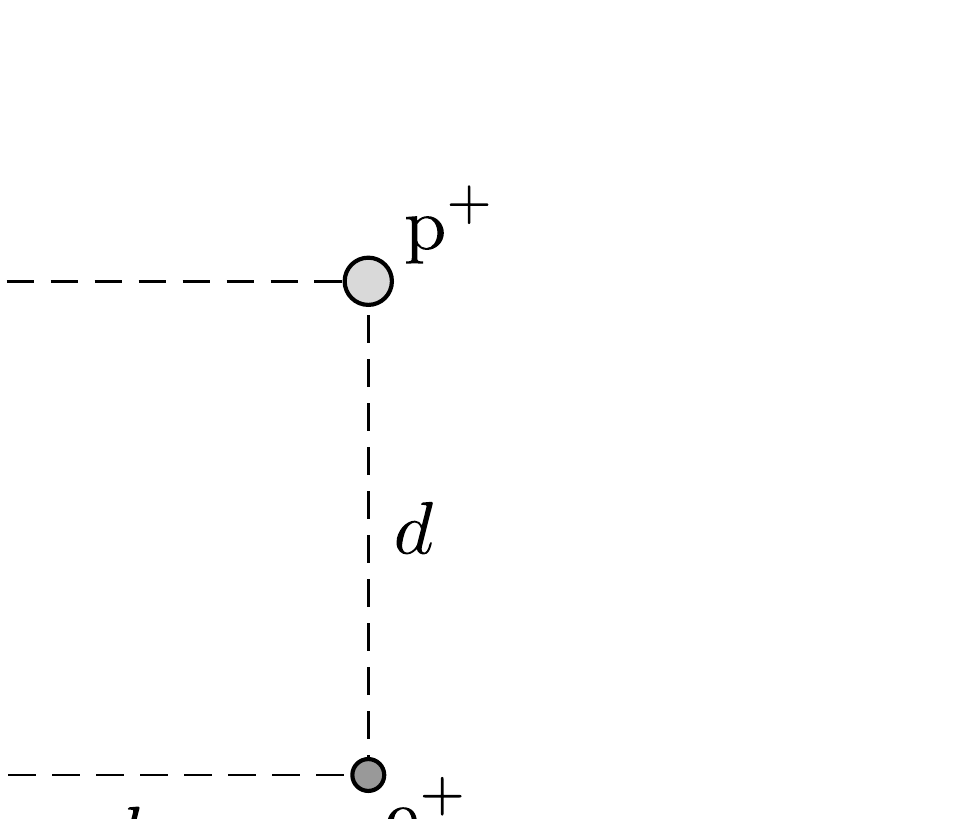

Egy $d=1 \mathrm{~cm}$ oldalélú négyzet átellenes csúcsaiban egy-egy pozitron, a másik két csúcsában pedig egy-egy proton található. (A pozitron az elektronnal azonos tömegú, de vele ellentétes töltésú részecske.)

Az eredetileg rögzített részecskéket hirtelen szabadon engedjük. Mekkora sebességgel fognak mozogni a részecskék akkor, amikor már nagyon messze lesznek

egymástól?

A részecskéket tekintsük klasszikus tömegpontoknak, pontosabban 1 cm-nél sokkal kisebb méretú golyócskáknak, amelyek egymás elektromos terében mozognak. A gravitáció figyelmen kívül hagyható.
