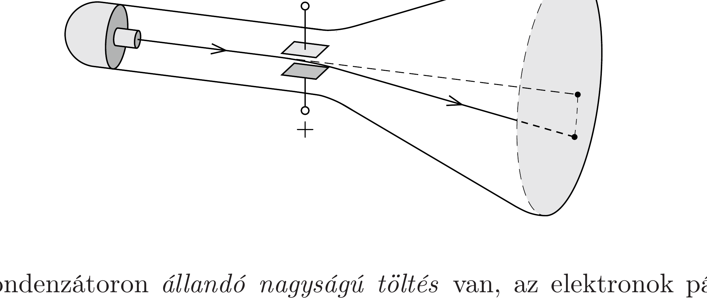

Egy katódsugárcsőben kis méretú síkkondenzátorral lehet eltéríteni az elektronágyúból érkező elektronokat. Ha a kondenzátor töltetlen, akkor az elektronok a forrás elhagyása után változatlan nagyságú és irányú sebességgel csapódnak be az ernyőbe.

Ha a kondenzátoron állandó nagyságú töltés van, az elektronok pályája elgörbül. Vajon a kezdősebességükhöz képest nagyobb vagy kisebb sebességgel csapódnak be ekkor az elektronok az ernyőbe? (A kondenzátor és az elektronágyú távolsága, valamint a kondenzátor és az ernyő távolsága sokkal nagyobb a kondenzátorlemezek méreténél.)
