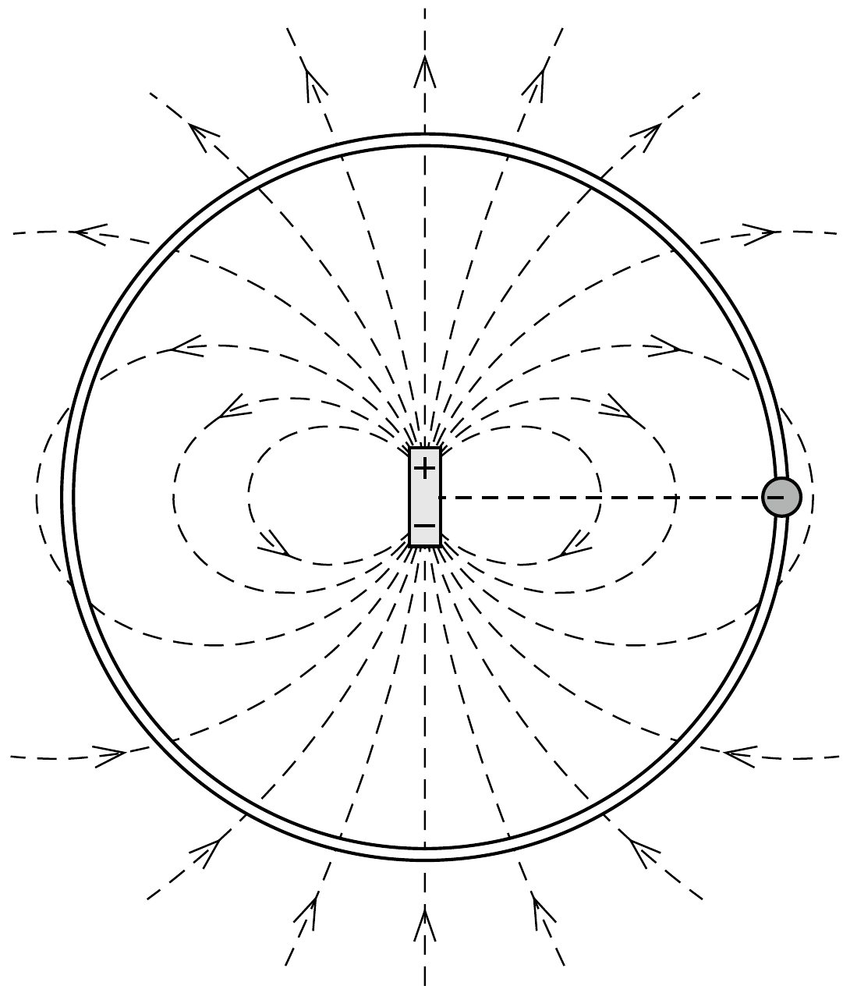

Egy elektromosan töltött kis gyöngyszem vízszintes síkban súrlódásmentesen mozoghat egy kör alakú szigetelő huzalon. A kör középpontjában vízszintes tengelyú, rögzített helyzetú elektromos dipól található. Kezdetben a gyöngyszem a dipól tengelyére merőleges helyzetben áll.
a) Mekkora eróvel nyomja mozgása során a gyöngyszem a huzalt?
b) Hol áll meg a gyöngyszem az elengedése után először?
c) Milyen pályán mozogna a gyöngyszem, ha nem lenne felfúzve a huzalra?

