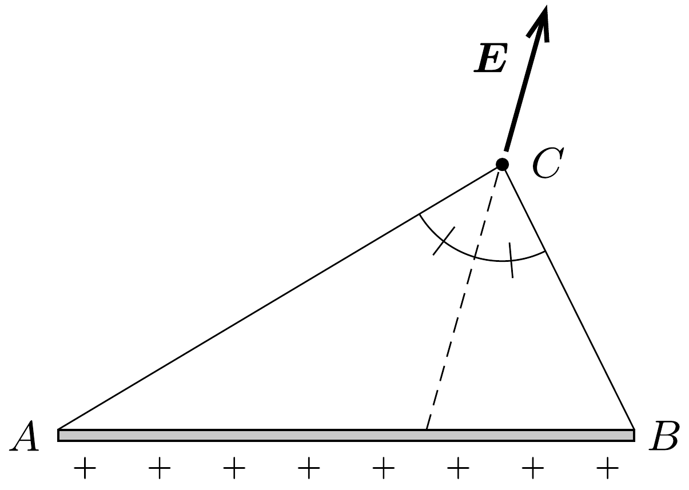

Egy hosszú, vékony szigetelő pálcán egyenletesen elosztva elektromos töltések helyezkednek el. Mutassuk meg, hogy az $A$ és $B$ végpontú pálca egy tetszőleges $C$ pontban olyan elektromos térerősséget hoz létre, amelynek iránya az $A B C$ háromszög $C$ csúcsához tartozó szögfelezőjével esik egybe!

