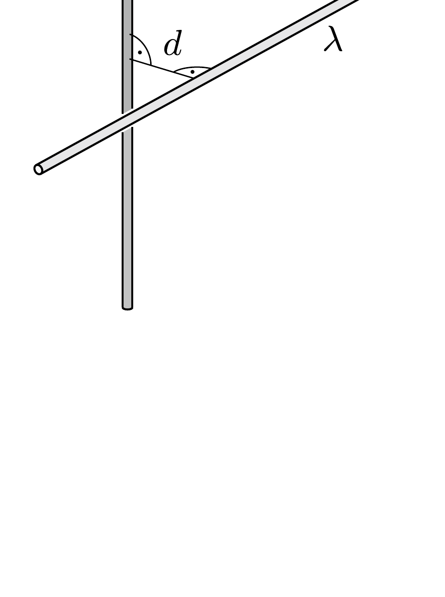

Két igen hosszú, $\lambda$ lineáris töltéssúrúségú, vékony múanyagpálca (kitéró egyeneseket alkotva) egymásra merőlegesen, egymástól $d$ távolságra helyezkedik el. Számítsuk ki a közöttük fellépő taszítóerőt!

