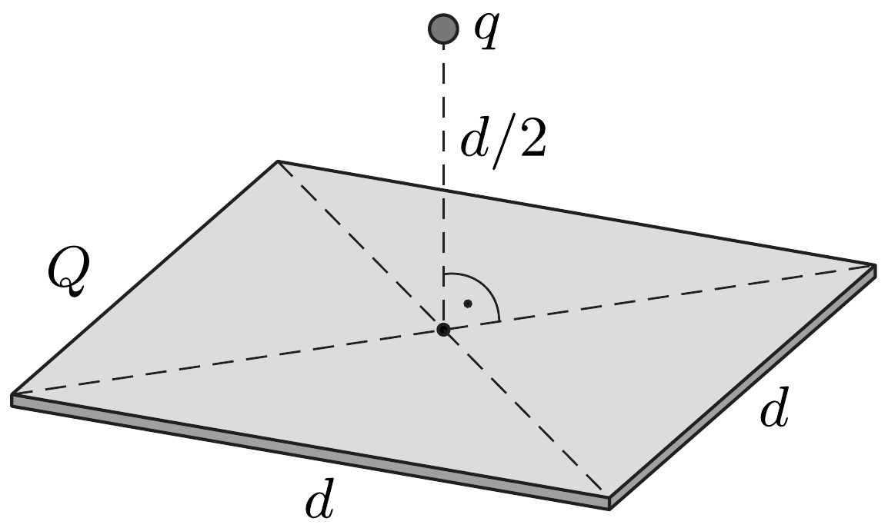

Egy vékony, $d$ oldalélú, négyzet alakú szigetelőlemezt $Q$ töltéssel egyenletesen feltöltünk. A lemez síkjára merőleges szimmetriatengelyen, a lemeztől $d / 2$ távolságra $q$ töltésú pontszerú testet helyezünk el. Mekkora erő hat a ponttöltésre?

