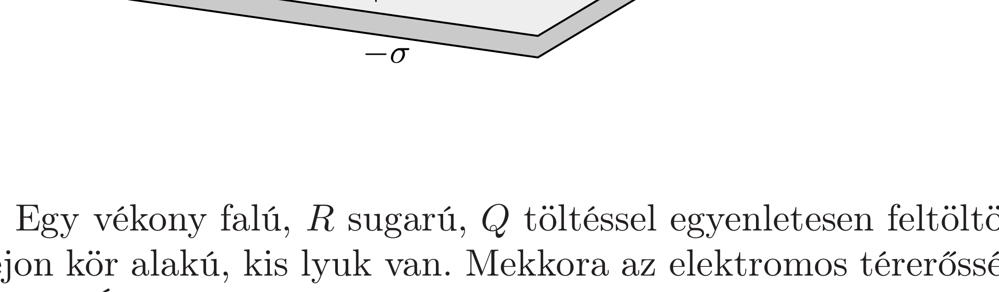

Két nagy kiterjedésú, egyforma, téglalap alakú szigetelőlemez vízszintes helyzetben pontosan egymás felett helyezkedik el egymástól $d$ távolságra. A lemezek egyenletesen töltöttek, a felsó felületi töltéssürúsége $+\sigma$, az alsóé $-\sigma$.

Mekkora és közelítőleg milyen irányú az elektromos térerősség az ábrán látható $P$ pontban, ami a felső lemez valamelyik élének felezőpontja felett $h$ magasságban található? (A $h$ távolság sokkal kisebb a szigetelőlemezek oldalhosszainál, de sokkal nagyobb a $d$ távolságnál.)

