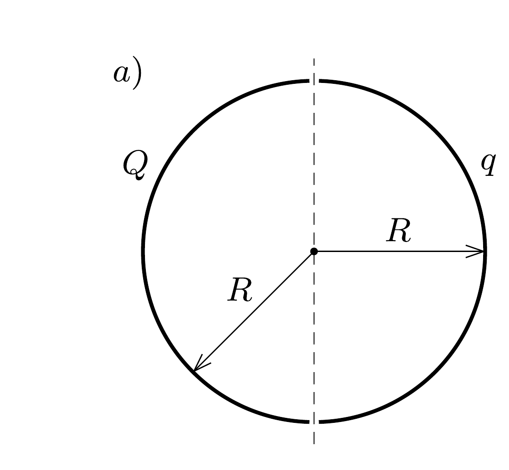
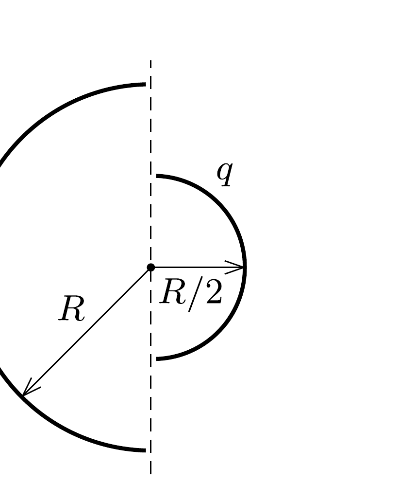

Két szigetelő félgömbhéjat (például két fél pingponglabdát) egymás közvetlen közelében helyezünk el az $a$ ) ábra szerint, koncentrikusan. Az egyikre $Q$, a másikra $q$ töltést viszünk fel, egyenletesen.

- a) Mekkora erót fejt ki egymásra e két test?
- b) Megváltozik-e az eredmény, ha az egyik félgömbhéj csak feleakkora sugarú, amint ezt a b) ábra mutatja?
