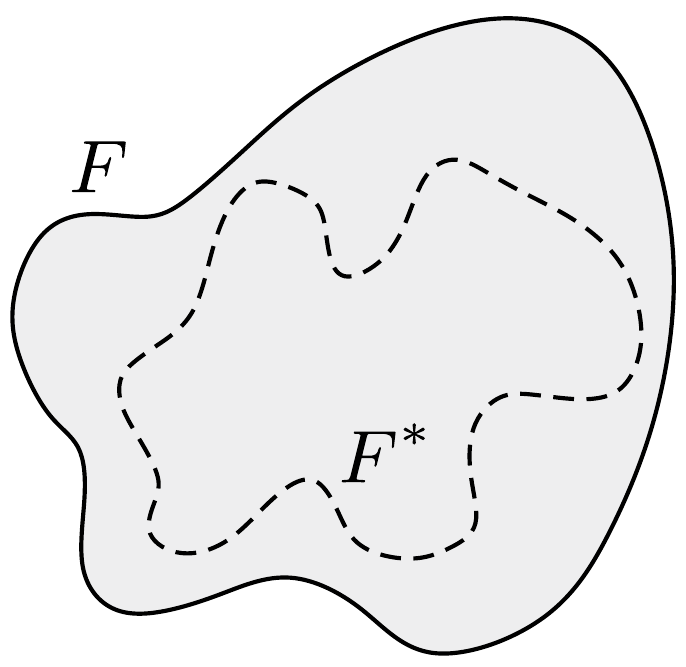

Vékony fémlemezből készült test zárt $F$ felületet alkot, melynek kapacitása $C$ (a „végtelen távoli" másik fegyverzethez képest). A fémlemezt behorpasztjuk úgy, hogy a kialakuló $F^{*}$ felület teljes egészében az eredeti felület belsejében, vagy annak határán helyezkedjen el.

Lássuk be, hogy a megváltozott alakú test kapacitása $C$-nél kisebb!

