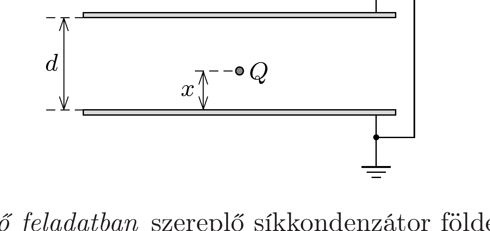

Egy síkkondenzátor $d$ távolságra lévó lemezeit leföldeljük, majd a kondenzátor belsejébe, az egyik lemeztől $x$ távolságra egy $Q$ töltésú, kis kiterjedésú testet helyezünk. Mekkora töltés halmozódik fel az egyes lemezeken?

