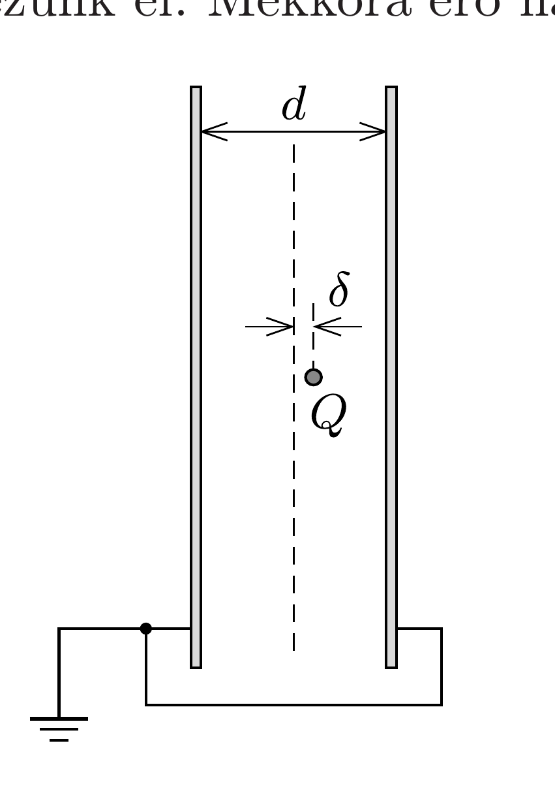

Egy síkkondenzátor $d$ távolságban lévő lemezeit leföldeljük, majd a lemezek között félúton elhelyezkedő (képzeletbeli) síktól $\delta \ll d$ távolságra egy $Q$ töltésú, kicsiny gyöngyöt helyezünk el. Mekkora erő hat a gyöngyre?

