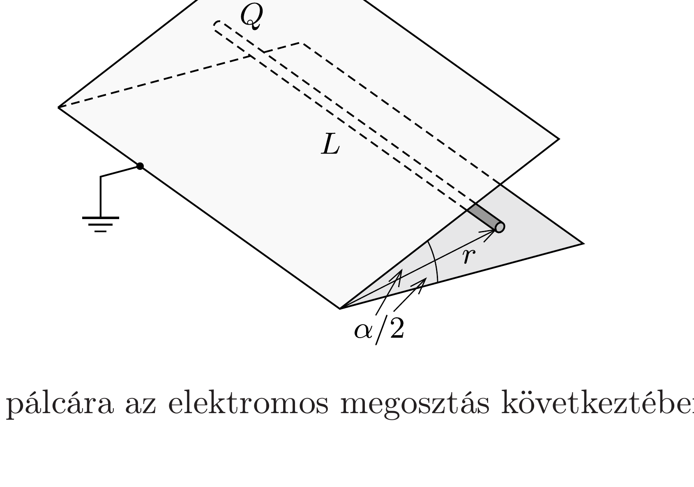

Két nagy méretú, földelt fémlap $\alpha$ szöget zár be egymással. A szögfelező síkban, a síkok metszésvonalától $r$ távolságban egy $L$ hosszúságú ( $L \gg r$ ), egyenletesen elosztott $Q$ töltésú, vékony pálca található.

Mekkora eró hat a pálcára az elektromos megosztás következtében, ha
- a) $\alpha=180^{\circ}$;
- b) $\alpha=18^{\circ}$ ?
