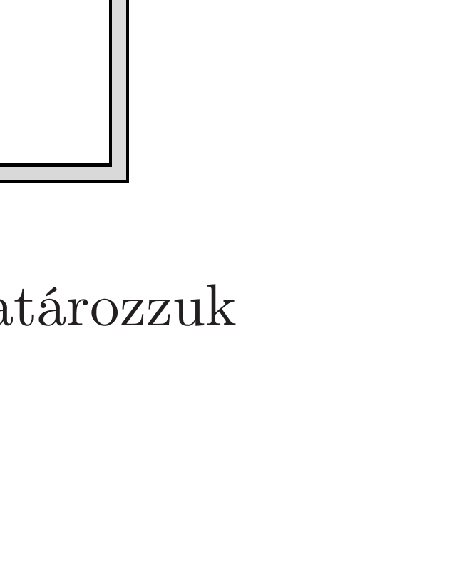

Hogyan mozog egy pozitron (az elektronnal azonos tömegú, de ellentétes töltésú részecske) egy Faraday-kalitkában, ha kezdősebesség nélkül „elejtjük”? (A pozitront tekintsük klasszikus részecskének, amelyre az elektromos erőkön kívül a földi gravitációs erőtér is hat. A kalitka mérete olyan, hogy a tükörtöltések hatása elhanyagolható.)

