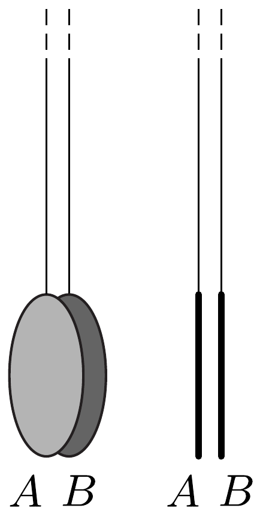
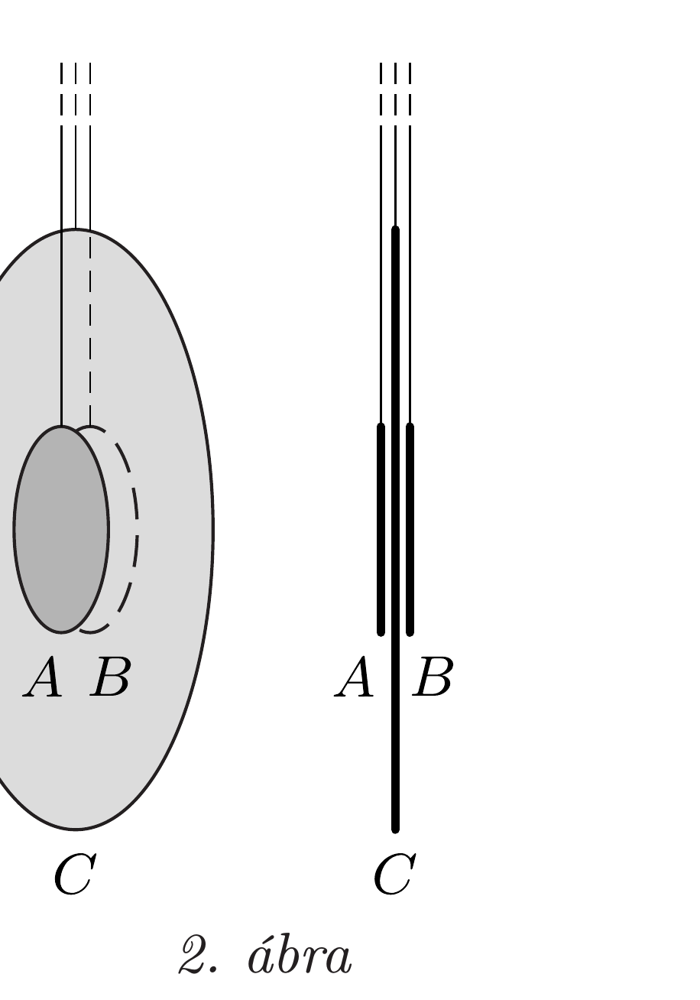

Két vékony fémkorong ( $A$ és $B$ ) mindegyikének átmérője 5 cm. A korongokat hosszú, elektromosan szigeteló fonalakkal függesztjük fel úgy, hogy körlapjaik párhuzamosak legyenek (lásd az 1. ábrát), és a közöttük lévó távolság kicsi legyen, mondjuk 2 mm. Mindkét korongnak azonos, kicsiny $q$ töltést adunk, ami olyan csekély, hogy a korongoknak a közöttük fellépő taszítóerő hatására bekövetkező elmozdulását elhanyagolhatjuk.

Egy $C$ jelú harmadik, vékony, $D>5 \mathrm{~cm}$ átmérőjú, töltetlen fémkorongot helyezünk az első kettő közé úgy, hogy ez a nagyobb méretú korong a behelyezés közben ne érjen hozzá a másik kettőhöz, valamint a múvelet végén ennek a körlapja is párhuzamos legyen a többivel, és pontosan a két szélső korong között félúton helyezkedjen el. A harmadik korong is hosszú szigetelő fonálon függ, valamint mindhárom korong középpontja ugyanazon a vízszintes egyenesen fekszik. Az elrendezést a 2. ábra mutatja.
a) Mutassuk meg, hogy a harmadik korong méretétől függően a két szélsőre ható erő lehet vonzó (befelé mutató), lehet taszító (kifelé mutató), sót akár nulla is!
b) Mekkora legyen a középső korong $D$ átmérője, hogy a két szélső korong bármelyikére ható eredő elektrosztatikus eró nullával legyen egyenlő?
