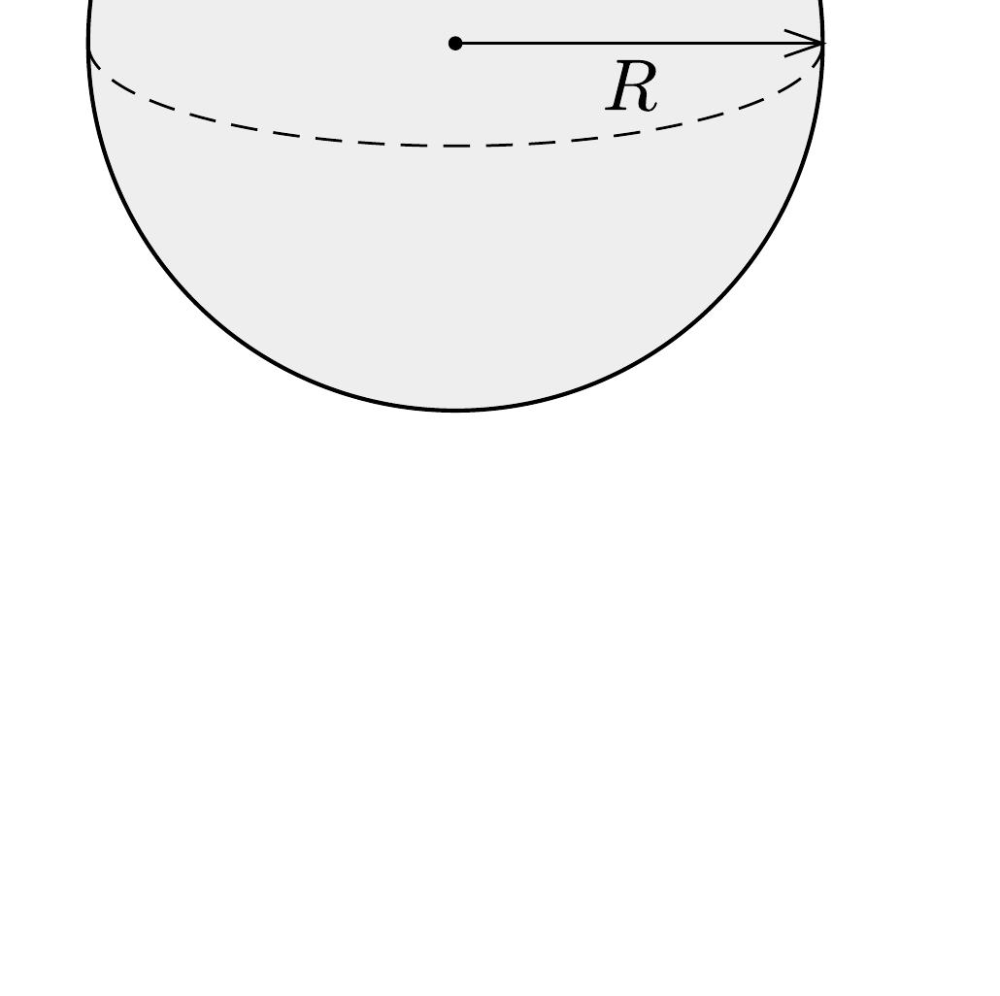

Van de Graaff-generátor $R$ sugarú gömbjének tetejére $d$ vastagságú, $\varrho$ súrúségú, $r$ alapsugarú, alufóliából készült gömbsüveget helyezünk. Mekkora feszültségnél emelkedik fel a süveg a gömbről?

