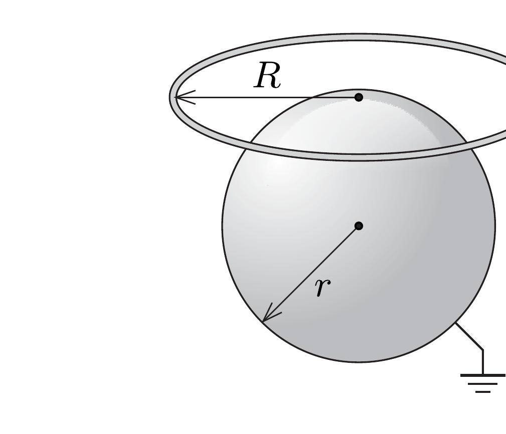

Egy ólomgömböt egy sík mentén két részre vágunk az ábra szerint. A vágási felületet hajszálvékony szigetelőréteggel látjuk el, utána a részeket újra teljes gömbbé egyesítjük. Ezután a gömb bal oldali részére kicsiny $Q$ töltést viszünk. Ábrázoljuk a gömb körül kialakuló eróvonalképet!

