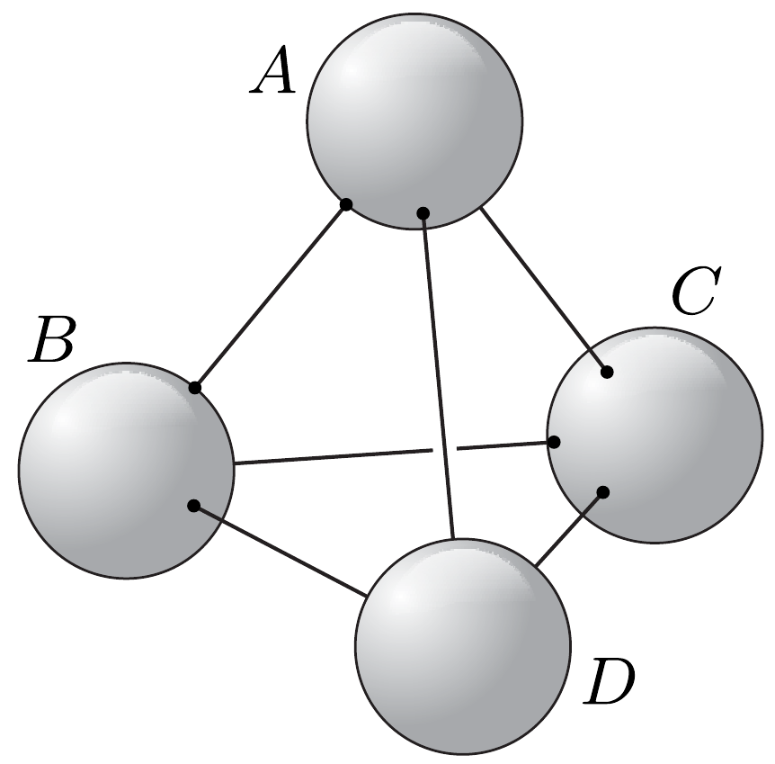

Egy szabályos tetraéder csúcsaiban egyforma fémgömbök helyezkednek el (a gömbök nem érnek össze). Egyetlen $(A)$ gömbre vitt 20 nC töltés azt ugyanakkora potenciálra tölti fel, mintha $A$-nak és egy másik gömbnek adnánk 15-15 nC töltést. Mekkora egyenlő töltéseket kellene adnunk $A$-nak és két másiknak, és mekkorát mind a négy gömbnek, hogy az $A$ gömb potenciálja mindig ugyanakkora legyen?

