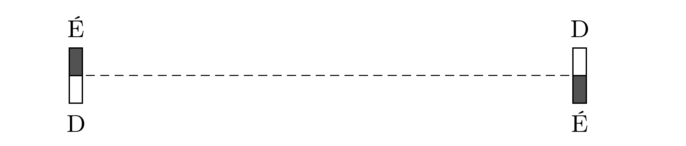

Két egyforma, kis méretú rúdmágnes egymástól távol helyezkedik el az ábrán látható módon.

Vajon melyik esetben végzünk több munkát és hányszor többet: ha a jobb oldali mágnesrúd tengelyét 180°-kal elforgatjuk, vagy ha a mágneseket összekötő szakasz meghosszabbítása mentén a jobb oldali mágnest nagyon messzire eltávolítjuk a bal oldalitól?
