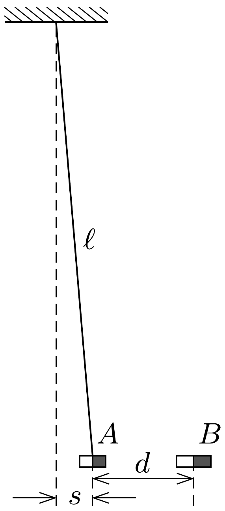

Az $m$ tömegú, nagyon rövid, $A$ jelú mágnest vízszintes helyzetében $\ell=1 \mathrm{~m}$ hosszúságú fonálra függesztettük. A szintén nagyon rövid, $B$ jelú mágnest lassan $A$ közelébe hozzuk úgy, hogy a két mágnes hossztengelye mindvégig közös, vízszintes egyenesen legyen. Amikor a két mágnes középpontja $d=4 \mathrm{~cm}$ távol van egymástól, és az $A$ mágnes középpontjának elmozdulása az eredeti helyzetétől $s=1 \mathrm{~cm}$, akkor az $A$ jelú mágnes egyszer csak váratlanul a $B$ mágneshez csapódik.
a) A mágnesek közötti kölcsönhatási eröt az $x$ távolságuk függvényében az $F_{\text {mágn }}(x)= \pm K / x^{n}$ összefüggés írja le, amelyben az előjel a mágnesek egymáshoz viszonyított elhelyezkedésétől függ. A megadott adatok alapján határozzuk meg az $n$ kitevó és a $K$ állandó értékét!

b) A $B$ mágnest egy alul zárt, függőleges üvegcső aljára tesszük. Az $A$ mágnest ezután úgy helyezzük el az üvegcsőben, hogy a két mágnes taszítsa egymást. Bár a mágnesek el akarnak fordulni a csőben, azonban a keskeny üvegcső fala ezt megakadályozza, ezért a mágnesek tengelye függőleges marad. Határozzuk meg egyensúlyi állapotban a mágnesek között kialakuló távolságot!
