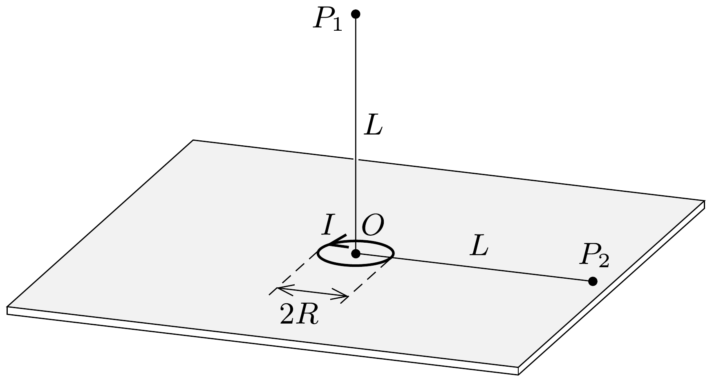

Vízszintes síkban egy $R$ sugarú, $I$ erősségú árammal átjárt körvezetó nyugszik (lásd az ábrát). Határozzuk meg a köráram $O$ középpontjától $L$ távolságra $(L \gg R)$ a mágneses indukció értékét
$a)$ az $O$ ponton átmenó függőleges tengelyen fekvő $P_{1}$ pontban (ún. Gauss-féle elsó főhelyzet);
b) a köráram síkjában elhelyezkedő $P_{2}$ pontban (Gauss-féle második főhelyzet)!

