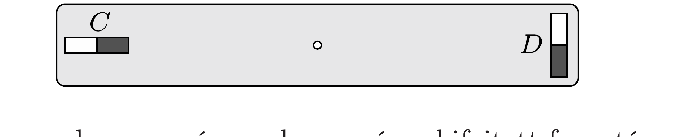

Két egyforma, $m$ dipólnyomatékú, kis méretú rúdmágnest egy $L$ hosszúságú rúd két végére erőśtettünk az ábra szerint. Az egyik $(C)$ mágnes tengelye a rúddal párhuzamos, a másiké $(D)$ a rúdra merőleges.

a) Mutassuk meg, hogy a mágnesek egymásra kifejtett forgatónyomatéka nem egyenlő nagyságú, és még csak nem is ellentétes irányú!
b) Vajon mi történik, ha a rendszert a tömegközéppontjában felfüggesztjük úgy, hogy szabadon elfordulhasson? (A Föld mágneses terétől tekintsünk el!)
