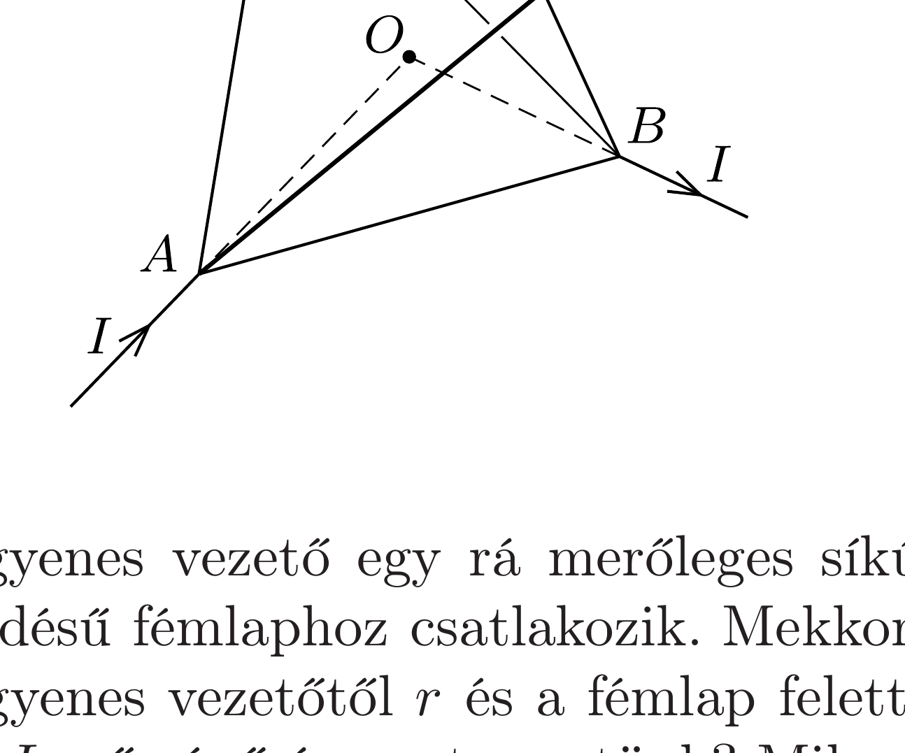

Homogén, egyenletes keresztmetszetú ellenálláshuzalból szabályos tetraédert állítottunk össze. Egy hosszú, egyenes, a tetraéder $O$ középpontjába irányuló vezetéken az $A$ csúcshoz $I$ áramot vezetünk, a $B$ csúcsból pedig hasonló módon elvezetjük. Mekkora és milyen irányú lesz a mágneses indukcióvektor a tetraéder középpontjában?

