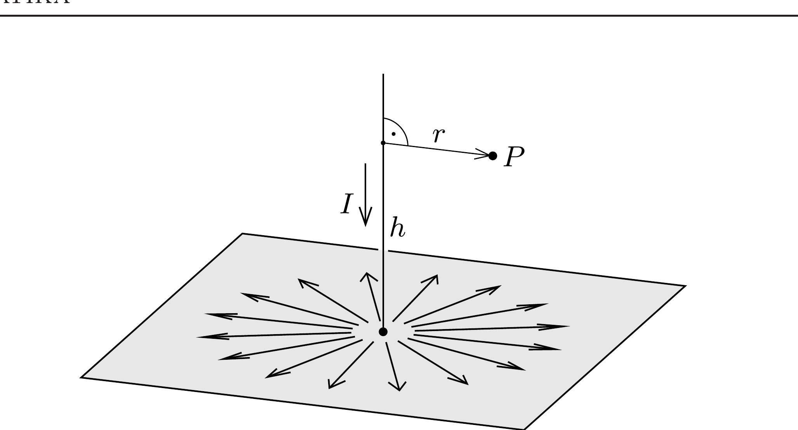

Hosszú, egyenes vezetó egy rá merőleges síkú, vékony, egyenletes vastagságú, nagy kiterjedésú fémlaphoz csatlakozik. Mekkora és milyen irányú a mágneses indukció az egyenes vezetőtől $r$ és a fémlap felett $h$ távolságra lévő $P$ pontban, ha a fémlapba $I$ erősségú áramot vezetünk? Milyen lesz a mágneses tér a fémlap alatt?

