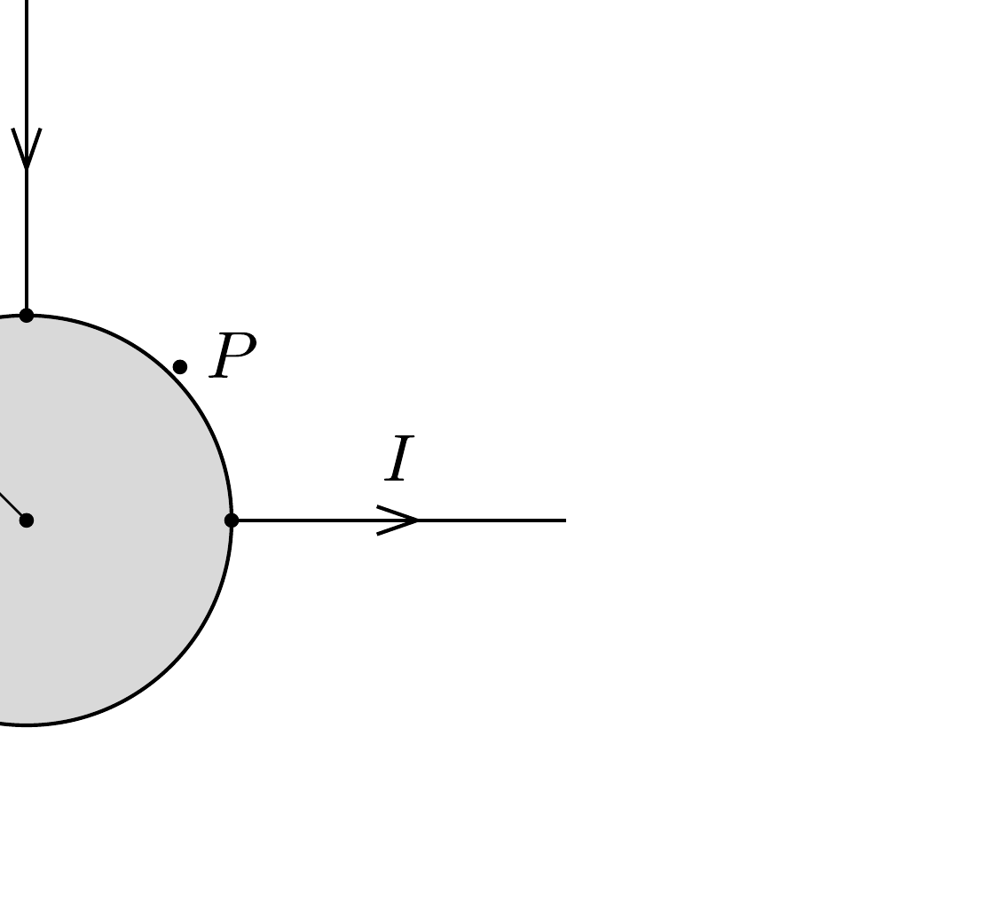

Egy múanyag földgömb felületét egyenletesen áramvezető anyaggal (például grafitréteggel) vonjuk be, és szigetelő állványra helyezzük. Az $R$ sugarú gömb egyik pontjába hosszú, sugárirányú, egyenes vezetővel $I$ erősségú áramot vezetünk, rá merőlegesen (szintén sugárirányban) pedig elvezetjük azt.

Milyen mágneses mező alakul ki a földgömb belsejében, illetve a gömbön kívül? Mekkora például a mágneses indukcióvektor az áramok be- és kivezetési pontja között „félúton” lévő $P$ pontban, egy „hajszál-

nyival" a földgömb felületén kívül?
