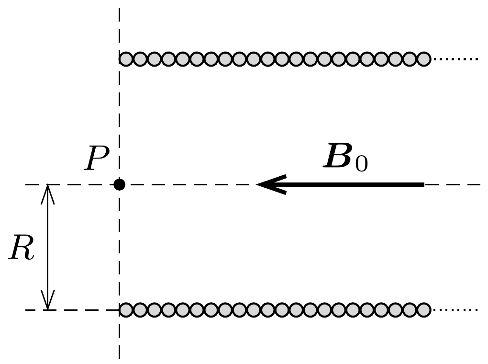

$R$ sugarú, $L$ hosszúságú $(L \gg R)$ szolenoid tekercsben folyó egyenáram hatására a szolenoid belsejében $B_{0}$ erősségú mágneses indukció alakul ki.

a) Mekkora a mágneses indukció a szolenoid tengelye mentén a tekercs egyik végénél (az ábrán látható $P$ pontban)?
b) Mekkora mágneses fluxus halad át a tekercs végén, a $P$ pontra illeszkedő körlapon?
$c$ ) Rajzoljuk fel vázlatosan a mágneses indukcióvonalakat a $P$ pont környezetében (néhányszor $R$ távolságokig)!
