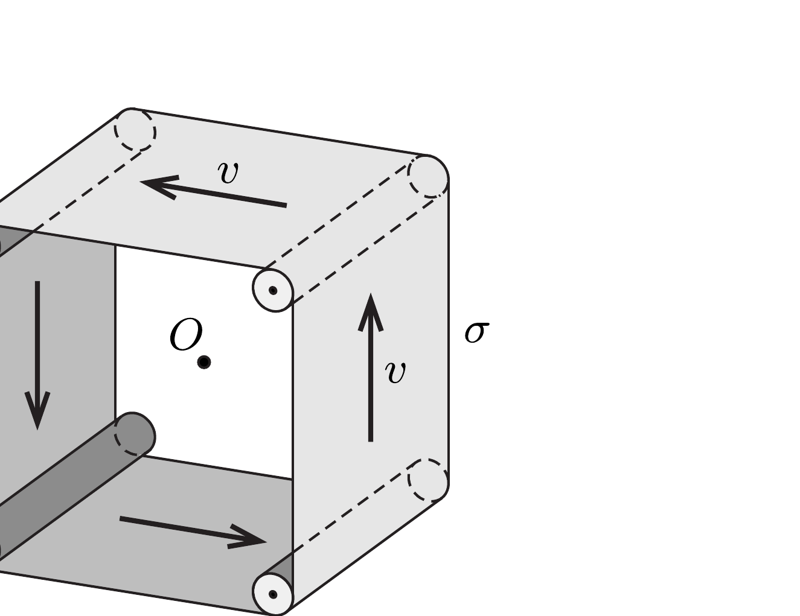

Egy $d$ szélességú, gumiból készült, zárt futószalagot az ábrán látható módon négy vékony, egymástól páronként $d$ távolságra elhelyezkedő görgőn vezetünk keresztül. A futószalagot egyenletesen feltöltjük $\sigma$ felületi töltéssúrúséggel, majd a görgőket motor segítségével forgatni kezdjük úgy, hogy a futószalag állandó $v$ sebességgel haladjon. (A görgők és a szalag is jó szigetelők, így a szalag nem veszíti el töltését.)

Mekkora a mágneses indukció értéke a futósza-

lag szélei által kijelölt kocka $O$ középpontjában?
