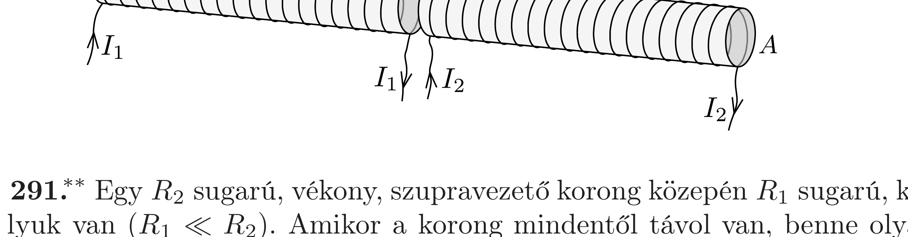

Két hosszú, egyforma légmagos szolenoid szorosan egymás mellett úgy helyezkedik el, hogy a tengelyük közös. A tekercsek keresztmetszete $A$, egységnyi hosszukra $n$ menet jut. Mekkora erő hat közöttük, ha az egyik tekercsbe $I_{1}$, a másikba $I_{2}$ erősségú áramot vezetünk?

