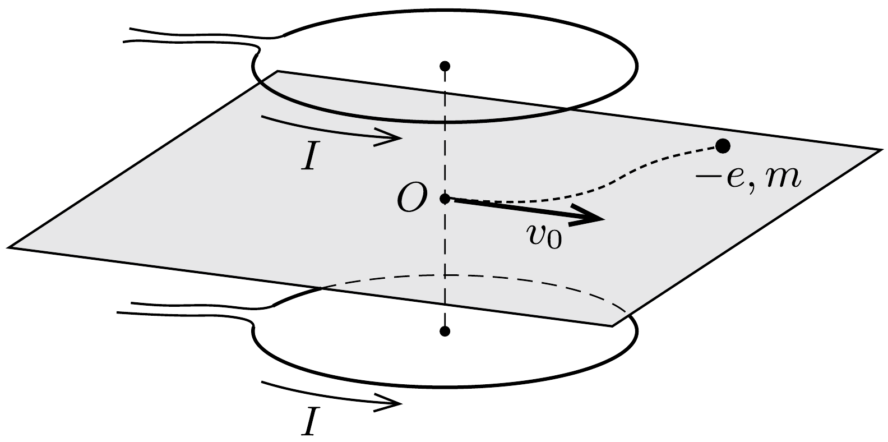

Két egyforma, egymással párhuzamos síkú körvezetőben időben állandó, $I$ erósségú áram folyik azonos irányban. A körök középpontját összekötő szakasz $O$ felezőpontjából egy elektron indul el $v_{0}$ sebességgel a körök síkjával párhuzamos irányban.

Az $O$ ponthoz képest milyen irányban és mekkora sebességgel fog mozogni az elektron, amikor már igen távolra jutott a körvezetőktől?
