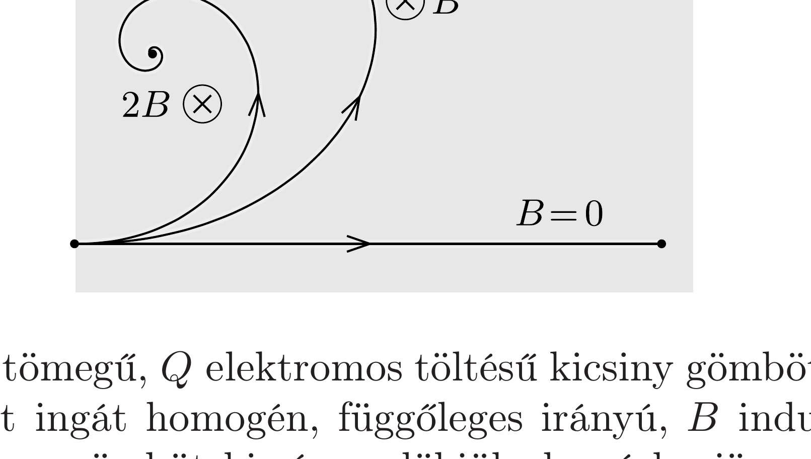

Egy töltött részecske olyan térrészbe ér, ahol a súrlódási eró arányos a sebességével. Itt a részecske a belépés helyétől 10 cm-re megáll. Ha ugyanez a részecske úgy kerül be a térrészbe, hogy ott a sebességére merőleges homogén mágneses mező is van, akkor a részecske a belépés helyétől 6 cm távolságra áll meg. Mekkora távolságra állna meg a részecske, ha a mágneses indukcióvektor kétszer akkora lenne?

