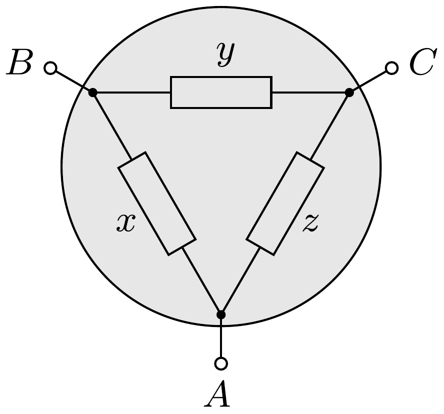

Az ábrán látható három kivezetéses elektromos fekete dobozban az $A$ és $B$, a $B$ és $C$, valamint a $C$ és $A$ pontok között mérhető ellenállás rendre $1 \Omega$, $2 \Omega$, illetve $3 \Omega$. Mennyi az $x, y$ és $z$ ellenállások értéke?

Ha felírjuk a megadott mért értékeket (ohm egységekben számolva) az ismeretlen ellenállásokkal kifejezve, a következő egyenletrendszert kapjuk:
\[
\begin{array}{lll}
\frac{1}{x}+\frac{1}{y+z}=1 & \longrightarrow & x(y+z)=x+y+z, \\
\frac{1}{y}+\frac{1}{x+z}=\frac{1}{2} & \longrightarrow & y(x+z)=2(x+y+z), \\
\frac{1}{z}+\frac{1}{x+y}=\frac{1}{3} & \longrightarrow & z(x+y)=3(x+y+z) .
\end{array}
\]
Ha az (1) és (2) egyenletek összegéből kivonjuk (3)-at, $2 x y=0$ adódik, ami $n e m$ lehetséges, hiszen nyilvánvaló, hogy sem $x$, sem $y$ nem lehet nulla!

Mi lehet ennek a matematikai „ellentmondásnak” a feloldása?
