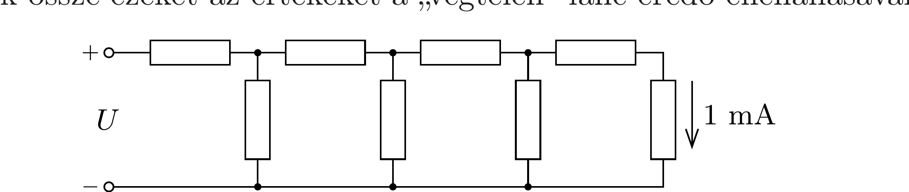

Az ábrán látható véges ellenálláslánc (létraáramkör) minden eleme $1 \mathrm{k} \Omega$-os, az utolsó elemen 1 mA erősségú áram folyik. Mekkora feszültséget kapcsoltunk a lánc bemenetére? Mekkora a lánc eredő ellenállása? Hogyan változik a lánc eredő ellenállása, ha még egy, illetve két ellenállást kapcsolunk a láncba? Hasonlítsuk össze ezeket az értékeket a „végtelen” lánc eredő ellenállásával!

