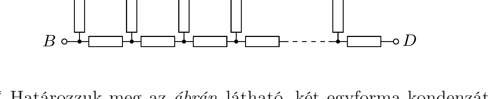

Az ábrán látható, $3 N$ azonos ellenállásból álló láncból zárt szalagot készítünk két különböző módon:
a) az $A$ és $C$, valamint a $B$ és $D$ csatlakozási pontokat páronként összekötjük (közönséges szalag);
b) az $A$ és $D$, valamint a $B$ és $C$ csatlakozási pontokat kötjük össze páronként (Möbius-szalag).

Melyik esetben lesz nagyobb az eredő ellenállás az $A$ és $B$ pontok között?

