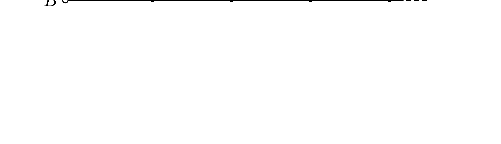

Mennyi az ábrán látható, csupa egyforma $L$ induktivitásokból és $C$ kapacitásokból álló végtelen lánc eredő váltóáramú ellenállása $\omega$ körfrekvencián az $A$ és $B$ pontok között? Lehet ez kétféle érték?

