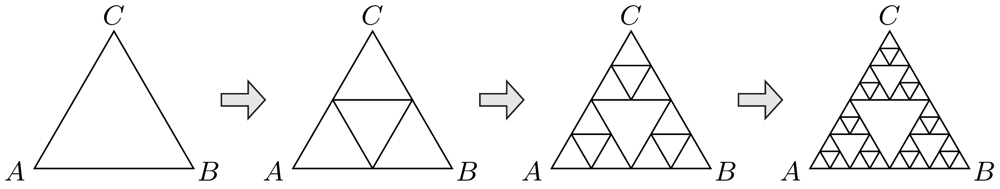

Vékony, egyenletes keresztmetszetú ellenálláshuzalból ún. Sierpinskiháromszöget szeretnénk forrasztani. Ehhez egy szabályos háromszög alakú keretből indulunk ki, melynek $A$ és $B$ csúcsai között $R_{0}$ ellenállást mérünk. A kerethez első lépésben hozzáforrasztjuk a háromszög középvonalait, majd második lépésben az így keletkezett négy kis háromszög közül a külső három középvonalait is beforrasztjuk. Az eljárást tovább folytatva önhasonló, fraktálszerú drótkeretet kapunk. Mekkora lesz az $A$ és $B$ pontok közötti ellenállás az $n$-edik lépés után?

