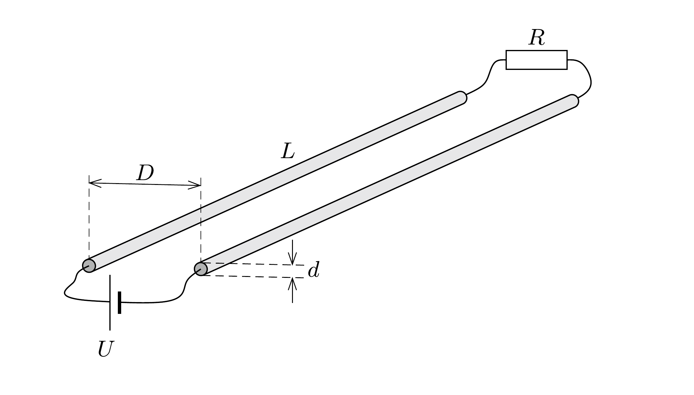

Két egyforma, $d$ átmérőjú, igen hosszú, elhanyagolható ellenállású egyenes vezető egymástól $D=50 d$ távolságra helyezkedik el. A vezetők egyik végét $U$ feszültségú telep, másik végét $R$ ellenállás köti össze. Mekkora az $R$ ellenállás, ha a vezetők között fellépő elektromos és mágneses erők egyenlő nagyok?

