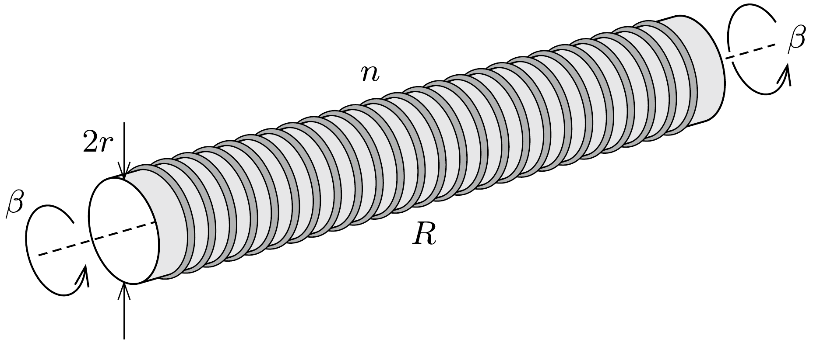

1917-ben két amerikai fizikus, T. D. Stewart és R. C. Tolman kimutatták, hogy egy rövidre zárt, hosszú tekercsben (szolenoidban) elektromos áram folyik, ha a tekercset hosszanti szimmetriatengelye körül valamekkora szöggyorsulással megforgatjuk.

A tekercset tekintsük nagy számú, vékony fémhuzalból készült, $r$ sugarú, $R$ ellenállású gyúrúnek, melyeket - hosszegységenként $n$ darabot - egy hosszú, hengeres üvegcsőre ragasztottunk fel.

Mekkora indukciójú mágneses tér alakul ki az üvegcső közepén, ha a hengert állandó $\beta$ szöggyorsulással forgatni kezdjük?
