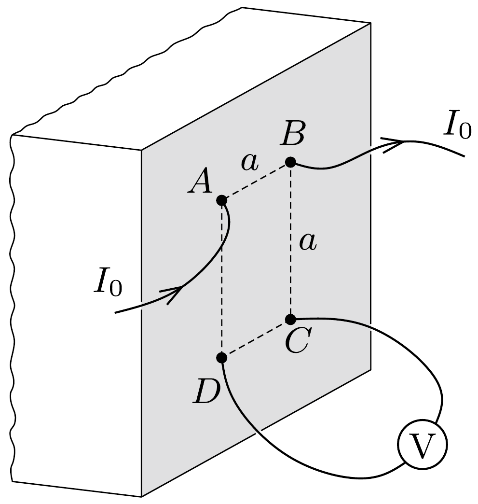

Egy sík a teret két féltérre osztja. Az egyik térfelet homogén, izotrop vezetó anyag tölti ki, a másik térfélen fizikusok dolgoznak. A síkra halványan $a$ oldalú négyzetet rajzolnak, amelynek két szomszédos csúcsában vékony elektródokkal $I_{0}$ áramot vezetnek be és ki. Eközben megmérik a másik két csúcspont közötti $U_{0}$ feszültséget. Hogyan számíthatják ki ezekből az adatokból a félteret kitöltő anyag fajlagos elektromos ellenállását?

