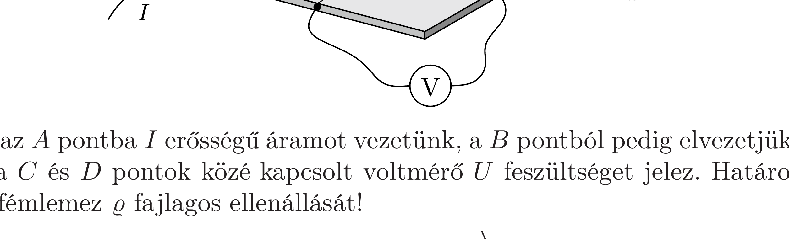

Egy nagy méretú, négyzet alakú, vékony fémlemez anyagának fajlagos ellenállását szeretnénk megmérni, azonban csak a lemez egyik sarkához férünk hozzá. Kiválasztjuk a lemez elérhető sarkának közelében a két szomszédos oldalélen található $A, B, C$ és $D$ pontokat az ábrán látható módon. Az $A$ és $B$ pontok távolsága a kiválasztott csúcstól $2 d$, a $C$ és $D$ pontoké pedig $d$, ahol $d$ sokkal kisebb a fémlemez oldalhosszánál, de sokkal nagyobb, mint a lemez $\delta$ vastagsága.

Ha az $A$ pontba $I$ erősségú áramot vezetünk, a $B$ pontból pedig elvezetjük azt, akkor a $C$ és $D$ pontok közé kapcsolt voltmérő $U$ feszültséget jelez. Határozzuk meg a fémlemez $\varrho$ fajlagos ellenállását!
