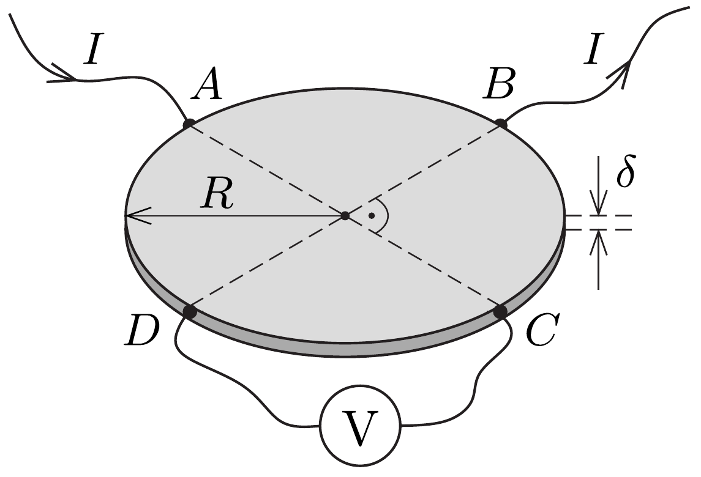

Egy $R$ sugarú, $\delta$ vastagságú $(\delta \ll R), \varrho$ fajlagos ellenállású fémkorong peremének ábrán látható $A$ pontjába $I$ erósségú áramot vezetünk, $B$ pontjából pedig elvezetjük azt. Mekkora feszültség mérhető a $C$ és $D$ pontok között?

