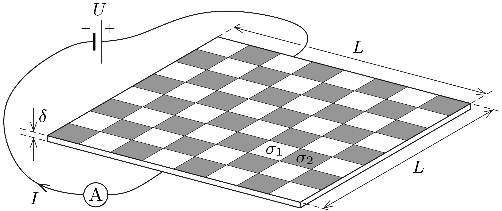

Egy sakktábla kétféle vékony, elektromosan gyengén vezető fémlemezból készült, és csak a szokásos $8 \times 8$ mezőt tartalmazza, szegélye nincs. A sakktábla két szemközti oldalához (azok teljes szélességében) nagyon jól vezetố, vékony fémcsíkok csatlakoznak (ezek nem látszanak az ábrán). A fémlemezek $\delta$ vastagsága sokkal kisebb, mint tábla $L$ szélessége. A világos mezők vezetőképessége $\sigma_{1}$, a sötét mezóké pedig $\sigma_{2}$.

Mekkora áram folyik át a sakktáblán, ha a szemközti, jól vezető fémcsíkokra $U$ nagyságú egyenfeszültséget kapcsolunk? (A mezők találkozásainál esetlegesen fellépó kontaktellenállások elhanyagolhatók.)
