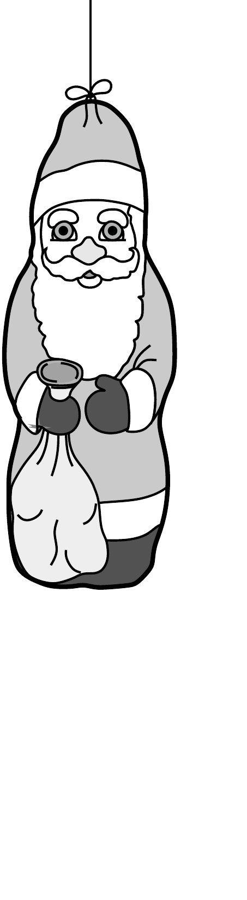
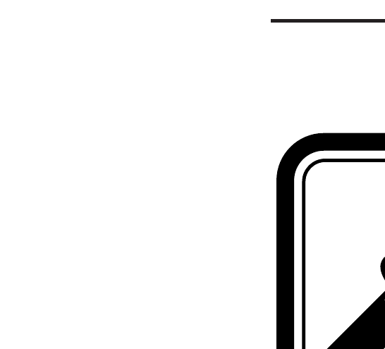

Szigetelőszálra függesztett, alufóliával bevont csokimikulást elektromosan feltöltöttünk. A mikulás a levegő csekély $\sigma$ vezetőképessége miatt lassan elveszíti a töltését. Mennyi idő alatt csökken a csokimikulás töltése a felére?

\section*{Elektromágneses indukció, időben változó mező̈k}
