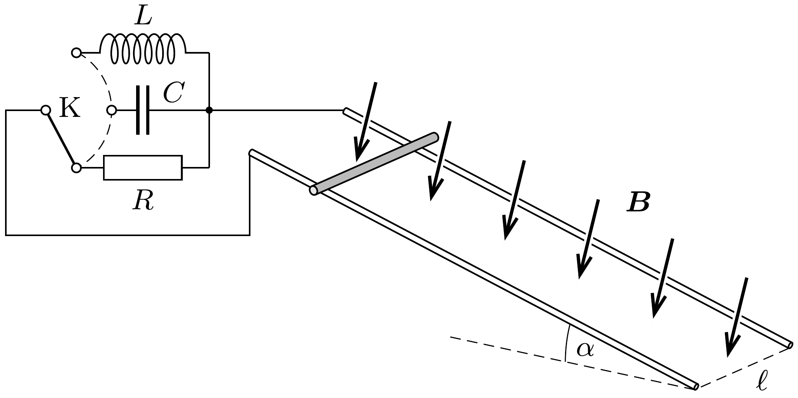

A homogén, $\boldsymbol{B}$ indukciójú mágneses mező merőleges az $\ell$ nyomtávú, lejtós sínpárra, amely a vízszintessel $\alpha$ szöget zár be. Hogyan mozog a nyugalomból induló, $m$ tömegú, súrlódásmentes rúd az elegendően hosszú sínpáron, ha a rúd és a sínpár alkotta áramkört
- a) $R$ ellenállással,
- b) $C$ kapacitású kondenzátorral,
- c) $L$ önindukciós együtthatójú tekerccsel zárjuk le?

