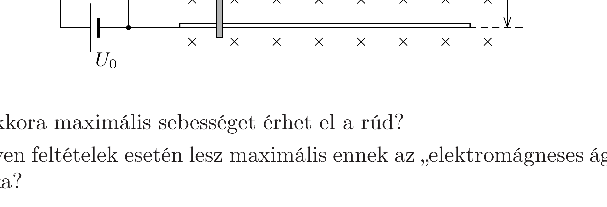

Elhanyagolható ellenállású, vízszintes síkban fekvő vezető sínpár egyik végét $C$ kapacitású kondenzátorral zárjuk, melyet előzőleg $U_{0}$ feszültségre töltöttünk. Az $\ell$ nyomtávolságú sínpárra $m$ tömegű, $R$ ellenállású vezető rudat helyeztünk merőlegesen. A rendszer függőleges irányú, $B$ indukciójú, homogén mágneses mezőben van. A kondenzátort olyan polaritással töltöttük fel, hogy a rúd az átkapcsolás után a kondenzátortól távolodni kezd. (A súrlódás és az összeállítás saját induktivitása elhanyagolható.)

- a) Mekkora maximális sebességet érhet el a rúd?
- b) Milyen feltételek esetén lesz maximális ennek az „elektromágneses ágyúnak” a hatásfoka?
