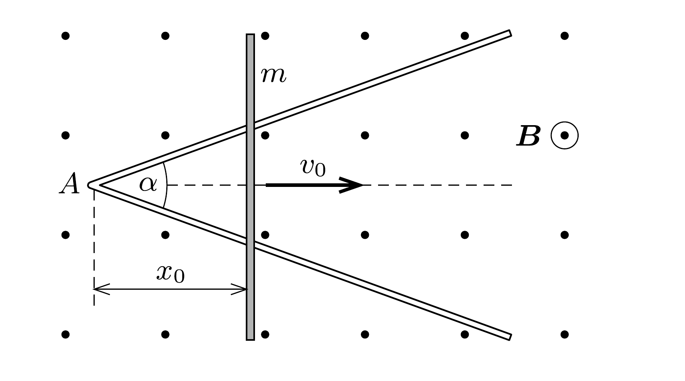

V alakban meghajlított, elhanyagolható ellenállású vezetó szál vízszintes síkban helyezkedik el, szárai $\alpha$ szöget zárnak be. A V alakú vezető szárain, annak $A$ csúcspontjától $x_{0}$ távolságra egy $m$ tömegű, hosszegységenként $r$ ellenállású, elegendően hosszú rúd fekszik az $\alpha$ szög szögfelezőjére merőlegesen, az ábrán látható módon. Az egész elrendezés függőleges irányú, homogén, $B$ indukciójú mágneses mezőben található.

A rudat a szögfelező irányában $v_{0}$ kezdősebességgel elindítjuk. A rúd és a V alakú vezető között jó az elektromos kontaktus, de a súrlódás elhanyagolható.

Hol áll meg a rúd?
