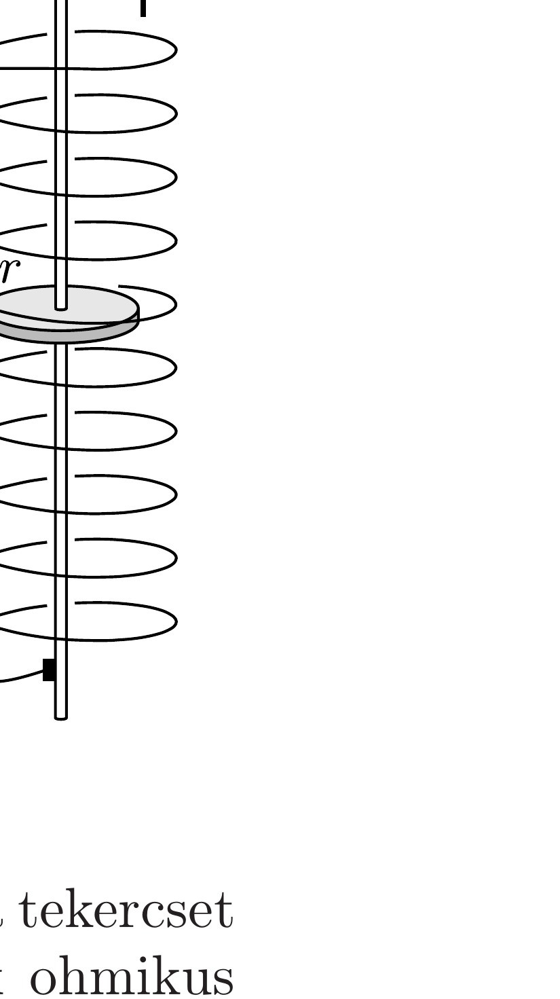

Egy hosszú, egyenes tekercsbe szimmetriatengelyével megegyező irányban tengelyezett, igen jó vezetőképességú anyagból készült, $r$ sugarú fémkorongot helyeztünk. A tekercs egyik kivezetését egy ampermérőn át csúszóérintkezóvel a korong pereméhez, a másik kivezetését a korong (vezető) tengelyéhez csatlakoztatjuk. A tekercs ohmos ellenállása $R$, egységnyi hosszára $n$ menet jut. A tekercset úgy helyezzük el, hogy a tengelye a Föld $\boldsymbol{B}_{0}$ mágneses indukcióvektorával azonos irányban álljon.

Mekkora áram folyik át az ampermérőn, ha a korongot $\omega$ szögsebességgel forgatjuk? Ábrázoljuk az áramerősséget $\omega$ függvényében mindkét forgásirány esetén!

Igazoljuk, hogy a korong forgatásához szükséges munka

megegyezik az ellenálláson keletkező Joule-hővel!
