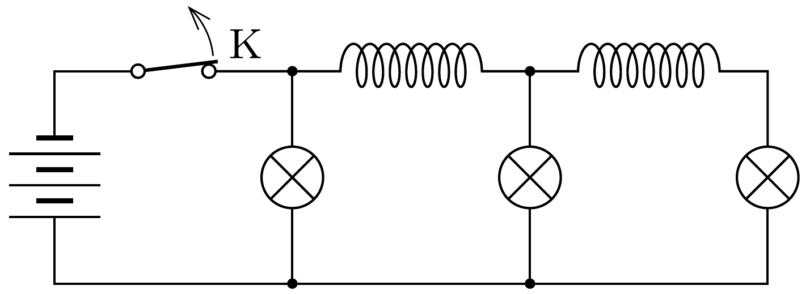

Az ábrán látható - három egyforma lámpát és két egyforma tekercset tartalmazó - hálózatot egyenáramú forrásra kapcsoltuk. (A tekercsek ohmikus ellenállása elhanyagolható.)

Egy ideig várunk, majd a K kapcsolót kikapcsoljuk. Mi lesz a lámpák fényességi sorrendje közvetlenül a kapcsoló kikapcsolása után?
