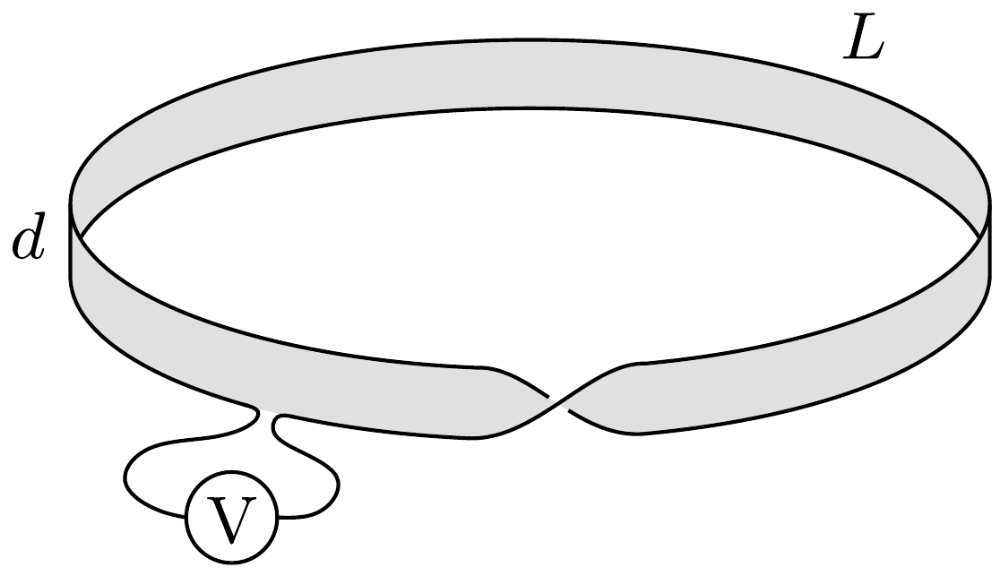
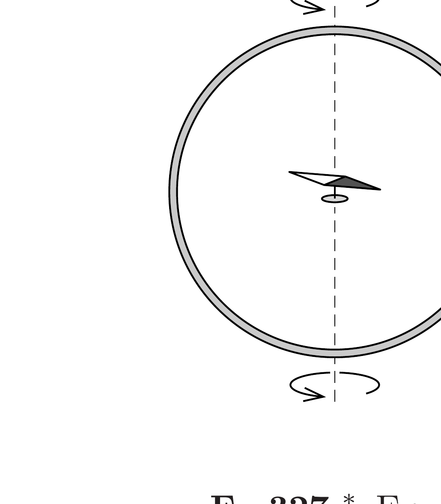

Egy $L$ hosszúságú, $d$ szélességú papírcsíkból kör alakú, „megtekert” szalagot (ún. Möbius-szalagot) készítünk. Mekkora feszültség indukálódik a szalag szélén végigvezetett drótdarabban, ha a szalagot a karika síkjára meróleges, időben $B(t)=k \cdot t$ módon egyenletesen változó indukciójú, homogén mágneses

mezőbe helyezzük?

