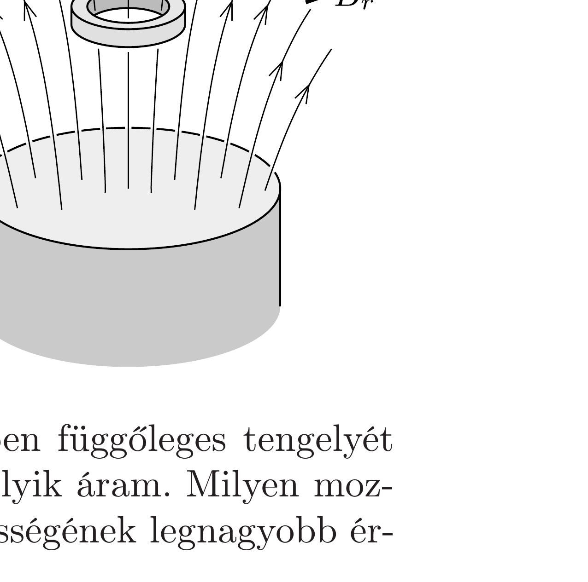

Egy vékony, elhanyagolható ellenállású (szupravezető) gyűrút függőleges helyzetú, henger alakú rúdmágnes fölött tartunk. A gyürú tengelye egybeesik a mágnes tengelyével. A gyúrú körüli hengerszimmetrikus mágneses mezó közelítőleg így jellemezhető a mágneses indukcióvektor függőleges és sugárirányú koordinátáival:
\[
B_{z}=B_{0}(1-\alpha z) \quad \text { és } \quad B_{r}=\frac{1}{2} B_{0} \alpha r,
\]
ahol $B_{0}$ és $\alpha$ állandók, továbbá $z$ és $r$ a függőleges,

illetve sugárirányú helykoordináták.

Elengedés után a gyúrú lefelé kezd mozogni, miközben függőleges tengelyét megtartja. Az elengedés pillanatában a gyűrúben nem folyik áram. Milyen mozgást végez a gyúrú? Mekkora a gyúrúben folyó áram erósségének legnagyobb értéke?

Adatok: A gyúrú tömege $m=50 \mathrm{mg}$, sugara: $r_{0}=0,5 \mathrm{~cm}$, önindukciós együtthatója $L=1,3 \cdot 10^{-8} \mathrm{H}$; a gyűrú középpontjának kezdeti koordinátái: $z=0$ és $r=0 ; B_{0}=0,01 \mathrm{~T} ; \alpha=32 \mathrm{~m}^{-1}$.
